# 准备工作

## 系统配置

1. 在虚拟机中安装Linux系统，本项目采用`VMware Workstation 16.1.2`和`Ubuntu 18.04`，本机系统为`Win 10`

2. 更新`Ubuntu 18.04`源并安装`open-vm-tools`

   1. 进入`/etc/apt/sources.list` 修改为国内镜像源（速度快），全部删除，替换为下述内容，如果更新报错，将`https`换成`http`

      ```shell
      # 默认注释了源码镜像以提高 apt update 速度，如有需要可自行取消注释
      deb https://mirrors.tuna.tsinghua.edu.cn/ubuntu/ bionic main restricted universe multiverse
      # deb-src https://mirrors.tuna.tsinghua.edu.cn/ubuntu/ bionic main restricted universe multiverse
      deb https://mirrors.tuna.tsinghua.edu.cn/ubuntu/ bionic-updates main restricted universe multiverse
      # deb-src https://mirrors.tuna.tsinghua.edu.cn/ubuntu/ bionic-updates main restricted universe multiverse
      deb https://mirrors.tuna.tsinghua.edu.cn/ubuntu/ bionic-backports main restricted universe multiverse
      # deb-src https://mirrors.tuna.tsinghua.edu.cn/ubuntu/ bionic-backports main restricted universe multiverse
      deb https://mirrors.tuna.tsinghua.edu.cn/ubuntu/ bionic-security main restricted universe multiverse
      # deb-src https://mirrors.tuna.tsinghua.edu.cn/ubuntu/ bionic-security main restricted universe multiverse
      
      # 预发布软件源，不建议启用
      # deb https://mirrors.tuna.tsinghua.edu.cn/ubuntu/ bionic-proposed main restricted universe multiverse
      # deb-src https://mirrors.tuna.tsinghua.edu.cn/ubuntu/ bionic-proposed main restricted universe multiverse
      ```

   2. 更新系统源：

      ```shell
      # update 是同步 /etc/apt/sources.list 和 /etc/apt/sources.list.d 中列出的源的索引，这样才能获取到最新的软件包
      sudo apt update
      # upgrade 是升级已安装的所有软件包(可选)
      # sudo apt upgrade
      ```

   3. 安装`open-vm-tools`：`sudo apt install open-vm-tools`

   4. ~~如果要实现文件夹共享，需要安装`open-vm-tools-dkms`：`sudo apt install open-vm-tools-dkms`~~=>清华源找不到`open-vm-tools-dkms`，不安装不影响

   5. 桌面环境还需要安装`open-vm-tools-desktop`以支持双向拖放文件：`sudo apt install open-vm-tools-desktop`

   6. 重启（使用`VMware`自带重启，使用`reboot`重启可能失败）后成功进行拖拽复制

   注：[参考链接](https://blog.csdn.net/hhdhz/article/details/87922794)

3. 在`Ubuntu 18.10`安装必要组件

   ```shell
   # 安装Vim环境
   sudo apt install vim
   
   # 用于远程连接虚拟机
   sudo apt install openssh-server
   
   # 用于查看IP地址
   sudo apt install net-tools
   
   # 树形查看文件夹内容
   sudo apt install tree
   ```

## VS code

1. 安装`Remote Development`插件

2. 在Linux中使用`ifconfig`查看`ip地址`

3. 按下图步骤设置`config`文件

   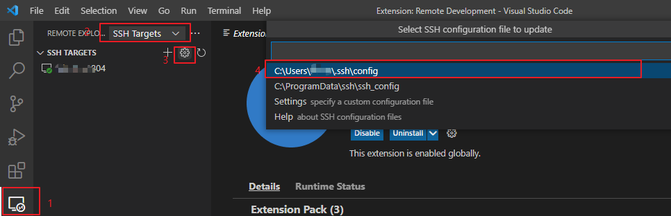

4. `config`内容如下

   ```shell
   # Read more about SSH config files: https://linux.die.net/man/5/ssh_config
   Host 自定义名称
       HostName 远程服务器IP
       User 远程服务器用户名
   ```

## GCC

### 说明

本部分笔记及源码出自`slide/01Linux系统编程入门/01 GCC`

### 安装`gcc`

命令：`sudo apt install gcc g++`，本项目安装版本为：`7.5.0`

### gcc工作流程

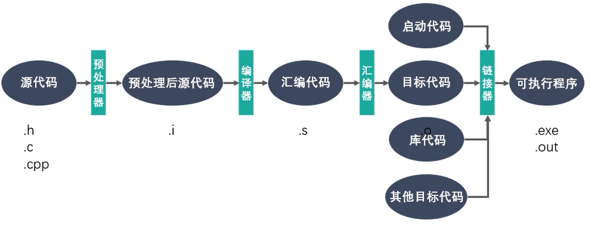

### gcc常用参数选项


- `-D`实例

  - 源程序

    ```c
    #include<stdio.h>
    
    int main()
    {
    #if DEBUG
        printf("Debug\n");
    #endif
        printf("hello, world\n");
        return 0;
    }
    ```

  - 编译命令1：

    ```shell
    gcc test.c -o test
    ./test
    
    # 输出
    hello, world
    ```

  - 编译命令2：

    ```shell
    gcc test.c -o test -D DEBUG
    ./test
    
    # 输出
    Debug
    hello, world
    ```

### gcc与g++区别

- `gcc` 和 `g++` 都是`GNU(组织)`的一个编译器
- **误区一**：`gcc` 只能编译 c 代码，g++ 只能编译 c++ 代码
  - 后缀为` .c` 的，`gcc` 把它当作是 C 程序，而 `g++` 当作是 `c++` 程序
  - 后缀为 `.cpp` 的，两者都会认为是 `C++` 程序，`C++` 的语法规则更加严谨一些
  - 编译阶段，`g++` 会调用 `gcc`，对于 `C++` 代码，两者是等价的，但是因为 `gcc` 命令不能自动和 `C++` 程序使用的库联接，所以通常用 `g++` 来完成链接，为了统一起见，干脆编译/链接统统用 `g++` 了，这就给人一种错觉，好像 `cpp` 程序只能用 `g++` 似的
- **误区二**：`gcc` 不会定义 `__cplusplus` 宏，而 `g++` 会 
  - 实际上，这个宏只是标志着编译器将会把代码按 C 还是 C++ 语法来解释
  - 如上所述，如果后缀为` .c`，并且采用 `gcc` 编译器，则该宏就是未定义的，否则，就是已定义
- **误区三**：编译只能用 `gcc`，链接只能用 `g++`
  - 严格来说，这句话不算错误，但是它混淆了概念，应该这样说：编译可以用 `gcc/g++`，而链接可以用 `g++` 或者 `gcc -lstdc++`
  - `gcc` 命令不能自动和C++程序使用的库联接，所以通常使用 `g++` 来完成链接。但在编译阶段，`g++` 会自动调用 `gcc`，二者等价

# Linux系统编程基础知识

## 静态库与动态库

### 说明

本部分笔记及源码出自`slide/01Linux系统编程入门/02 静态库与动态库`

### 库

- 库文件是计算机上的一类文件，可以简单的把库文件看成一种代码仓库，它提供给使用者一些**可以直接拿来用的变量、函数或类**
- 库是特殊的一种程序，编写库的程序和编写一般的程序区别不大，只是**库不能单独运行**
- 库文件有两种，`静态库`和`动态库（共享库）`。区别是：
  - **静态库**在程序的链接阶段被复制到了程序中
  - **动态库**在链接阶段没有被复制到程序中，而是程序在运行时由系统动态加载到内存中供程序调用
- 库的好处：**代码保密** 和**方便部署和分发**

### 静态库的制作

- 规则

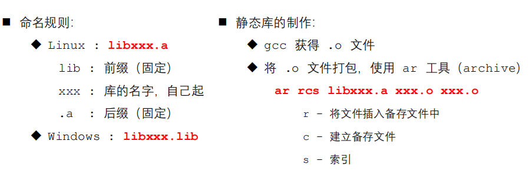

- 示例：有如下图所示文件(其中每个分文件用于实现四则运算)，将其打包为**静态库**

  

  1. 生成`.o`文件：`gcc -c 文件名`

     

  2. 将`.o`文件打包：`ar rcs libxxx.a xx1.o xx2.o`

     

### 静态库的使用

- 需要提供**静态库文件和相应的头文件**，有如下结构文件，其中`main.c`测试文件

  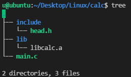

  ```c
  // main.c
  #include <stdio.h>
  #include "head.h"
  
  int main()
  {
      int a = 20;
      int b = 12;
      printf("a = %d, b = %d\n", a, b);
      printf("a + b = %d\n", add(a, b));
      printf("a - b = %d\n", subtract(a, b));
      printf("a * b = %d\n", multiply(a, b));
      printf("a / b = %f\n", divide(a, b));
      return 0;
  }
  ```

- 编译运行：`gcc main.c -o app -I ./include -l calc -L ./lib`

  - `-I ./include`：指定头文件目录，如果不指定，出现以下错误

    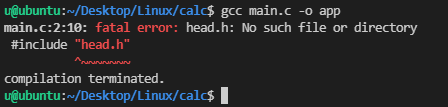

  - `-l calc`：指定静态库名称，如果不指定，出现以下错误

    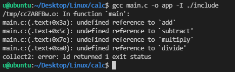

  - `-L ./lib`：指定静态库位置，如果不指定，出现以下错误

    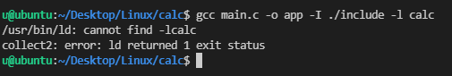

  - **正确执行**（成功生成`app`可执行文件）

    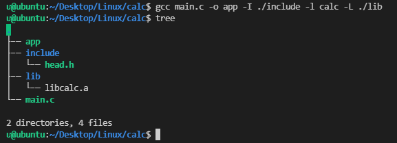

  - 测试程序

    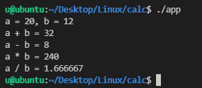

### 动态库的制作

- 规则

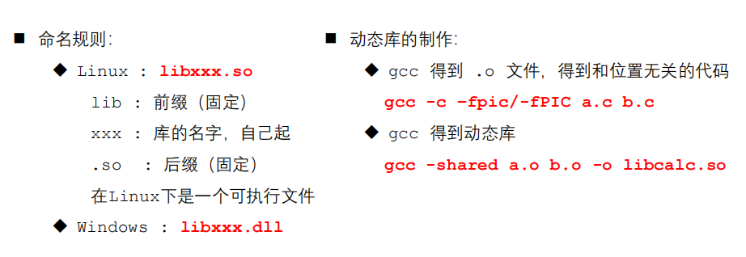

- 示例：有如下图所示文件(其中每个分文件用于实现四则运算)，将其打包为**动态库**

  

  1. 生成`.o`文件：`gcc -c -fpic 文件名`

     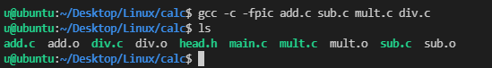

  2. 将`.o`文件打包：`gcc -shared xx1.o xx2.o -o libxxx.so`

     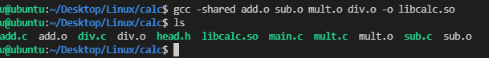

### 动态库的使用

- 需要提供**动态库文件和相应的头文件**

- 定位动态库（**原因见工作原理->如何定位共享库文件**，其中路径为动态库所在位置）

  - 方法一：修改环境变量，**当前终端生效**，退出当前终端失效

    ```shell
    export LD_LIBRARY_PATH=$LD_LIBRARY_PATH:/home/u/Desktop/Linux/calc/lib
    ```

  - 方法二：修改环境变量，用户级别永久配置

    ```shell
    # 修改~/.bashrc
    vim ~/.bashrc
    
    # 在~/.bashrc中添加下行，保存退出
    export LD_LIBRARY_PATH=$LD_LIBRARY_PATH:/home/u/Desktop/Linux/calc/lib
    
    # 使修改生效
    source ~/.bashrc
    ```

  - 方法三：修改环境变量，系统级别永久配置

    ```shell
    # 修改/etc/profile
    sudo vim /etc/profile
    
    # 在~/.bashrc中添加下行，保存退出
    export LD_LIBRARY_PATH=$LD_LIBRARY_PATH:/home/u/Desktop/Linux/calc/lib
    
    # 使修改生效
    source /etc/profile
    ```

  - 方法四：修改`/etc/ld.so.cache文件列表`

    ```shell
    # 修改/etc/ld.so.conf
    sudo vim /etc/ld.so.conf
    
    # 在/etc/ld.so.conf中添加下行，保存退出
    /home/u/Desktop/Linux/calc/lib
    
    # 更新配置
    sudo ldconfig
    ```

- 有如下结构文件，其中`main.c`测试文件

  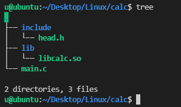

- 编译运行：`gcc main.c -o app -I ./include -l calc -L ./lib`

  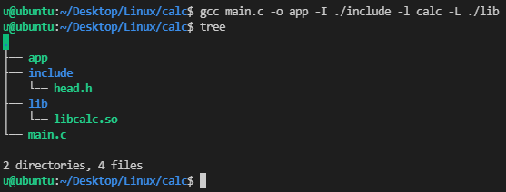

- 测试程序

  

- 如果不将动态库文件绝对路径加入环境变量，则会出现以下错误

  

### 工作原理

- 静态库：`GCC` 进行链接时，会把静态库中代码打包到可执行程序中

- 动态库：`GCC` 进行链接时，动态库的代码不会被打包到可执行程序中

- 程序启动之后，动态库会被动态加载到内存中，通过 `ldd （list dynamic dependencies）`命令检查动态库依赖关系

  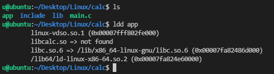

- 如何定位共享库文件呢？

  - 当系统加载可执行代码时候，能够知道其所依赖的库的名字，但是还需要知道**绝对路径**。此时就需要系统的动态载入器来获取该绝对路径
  - 对于`elf格式`的可执行程序，是由`ld-linux.so`来完成的，它先后搜索`elf文件`的 `DT_RPATH`段 => `环境变量LD_LIBRARY_PATH` => `/etc/ld.so.cache文件列表` => `/lib/`，`usr/lib`目录找到库文件后将其载入内存

### 静态库和动态库的对比

#### 程序编译成可执行程序的过程

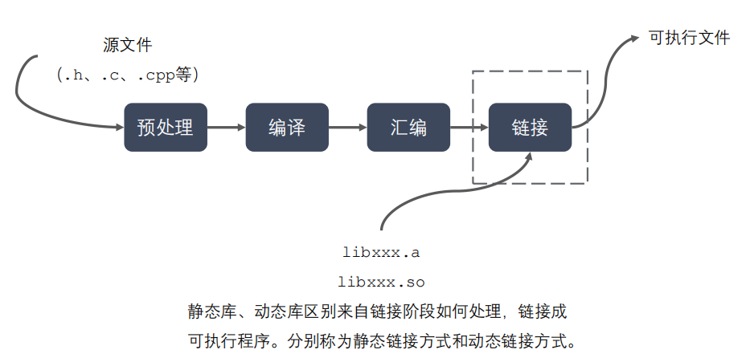

#### 静态库制作过程

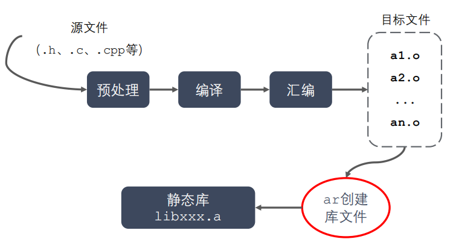

#### 动态库制作过程

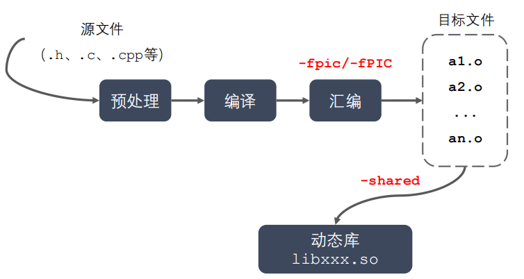

#### 静态库的优缺点

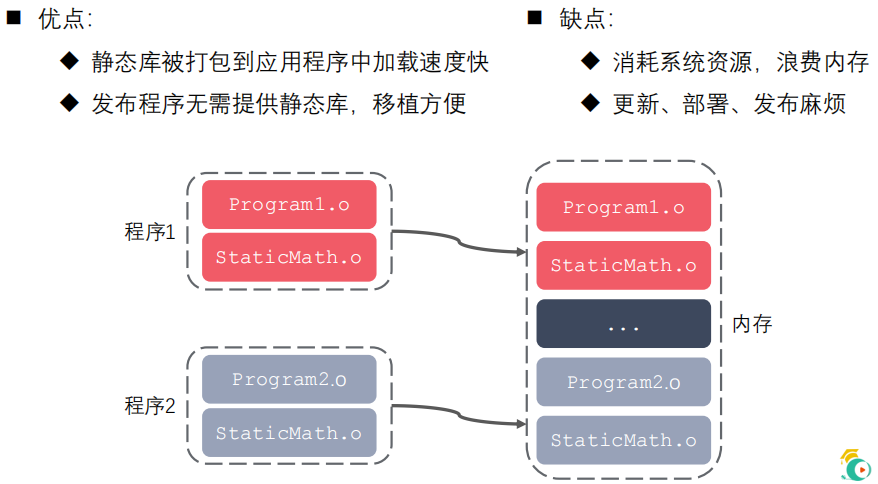

#### 动态库的优缺点

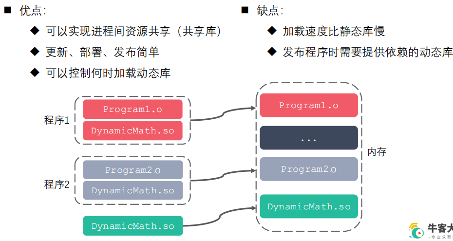

## Makefile

### 说明

本部分笔记及源码出自`slide/01Linux系统编程入门/03 Makefile`

### 概念及安装

- 一个工程中的源文件不计其数，其按类型、功能、模块分别放在若干个目录中，`Makefile` 文件定义了一系列的规则来指定哪些文件需要先编译，哪些文件需要后编译，哪些文件需要重新编译，甚至于进行更复杂的功能操作，因为 `Makefile` 文件就像一个 `Shell` 脚本一样，也可以执行操作系统的命令
- `Makefile` 带来的好处就是“自动化编译” ，一旦写好，只需要一个 `make` 命令，整个工程完全自动编译，极大的提高了软件开发的效率。
- `make` 是一个命令工具，是一个解释 `Makefile` 文件中指令的命令工具，一般来说，大多数的 `IDE` 都有这个命令，比如 Delphi 的 `make`，Visual C++ 的 `nmake`，Linux 下 GNU 的 `make`
- 安装：`sudo apt install make`，安装时会安装`man 手册`

### Makefile 文件命名和规则

- 文件命名：`makefile` 或者 `Makefile`

- `Makefile` 规则

  - 一个 `Makefile` 文件中可以有一个或者多个规则

    

    - **目标**：最终要生成的文件（伪目标除外）
    - **依赖**：生成目标所需要的文件或是目标
    - **命令**：通过执行命令对依赖操作生成目标（命令前必须 Tab 缩进）

  - `Makefile` 中的其它规则一般都是为第一条规则服务的。

### Makefile编写方式

#### 说明

假设有如下文件


#### 方式一：Makefile+直接编译链接（不推荐）

```makefile
app:add.c div.c multi.c sub.c main.c
	gcc add.c div.c multi.c sub.c main.c -o app
```

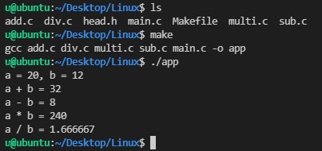

#### 方式二：Makefile+编译+链接

```makefile
app:add.o div.o multi.o sub.o main.o
	gcc add.o div.o multi.o sub.o main.o -o app

add.o:add.c
	gcc -c add.c -o add.o

div.o:div.c
	gcc -c div.c -o div.o

multi.o:multi.c
	gcc -c multi.c -o multi.o

sub.o:sub.c
	gcc -c sub.c -o sub.o

main.o:main.c
	gcc -c main.c -o main.o
```

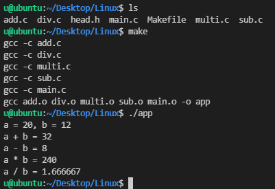

#### 方式三：Makefile+变量

##### 知识点

- 自定义变量：`变量名=变量值`，如`var=hello`

- 预定义变量

  - `AR` : 归档维护程序的名称，默认值为 ar

  - `CC `: C 编译器的名称，默认值为 cc

  - `CXX` : C++ 编译器的名称，默认值为 g++

  - `$@` : 目标的完整名称

  - `$<` : 第一个依赖文件的名称

  - `$^`: 所有的依赖文件

  - 示例

    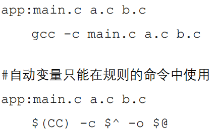

- 获取变量的值：`$(变量名)`，如`$(var)`

##### 示例

```makefile
src=add.o div.o multi.o sub.o main.o
target=app
$(target):$(src)
	$(CC) $^ -o $@

add.o:add.c
	$(CC) -c $^ -o $@

div.o:div.c
	$(CC) -c $^ -o $@

multi.o:multi.c
	$(CC) -c $^ -o $@

sub.o:sub.c
	$(CC) -c $^ -o $@

main.o:main.c
	$(CC) -c $^ -o $@
```

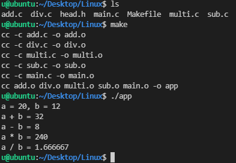

#### 方式四：Makefile+模式匹配

##### 知识点

当所要编译的文件过多时，使用模式匹配能够简化操作

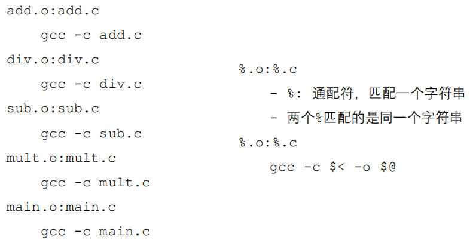

##### 示例

```makefile
src=add.o div.o multi.o sub.o main.o
target=app
$(target):$(src)
	$(CC) $^ -o $@

%.o:%.c
	$(CC) -c $< -o $@
```

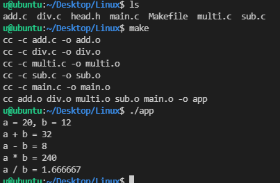

#### 方法五：Makefile + 函数

##### 知识点

- `$(wildcard PATTERN...)`

  - 功能：获取指定目录下指定类型的文件列表

  - 参数：PATTERN 指的是某个或多个目录下的对应的某种类型的文件，如果有多个目录，一般使用空格间隔

  - 返回：得到的若干个文件的文件列表，文件名之间使用空格间隔

  - 示例

    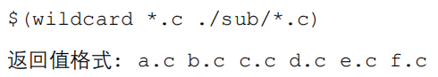

- `$(patsubst <pattern>,<replacement>,<text>)`

  - 功能：查找`<text>`中的单词(单词以“空格”、“Tab”或“回车”“换行”分隔)是否符合模式`<pattern>`，如果匹配的话，则以`<replacement>`替换

  - `<pattern>`可以包括通配符`%`，表示任意长度的字串。如果`<replacement>`中也包含`%`，那么，`<replacement>`中的这个`%`将是`<pattern>`中的那个%所代表的字串。(可以用`\`来转义，以`\%`来表示真实含义的`%`字符)

  - 返回：函数返回被替换过后的字符串

  - 示例

    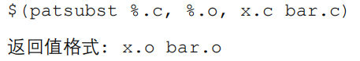

##### 示例

```makefile
src=$(wildcard ./*.c)
objs=$(patsubst %.c, %.o, $(src))
target=app
$(target):$(objs)
	$(CC) $^ -o $@

%.o:%.c
	$(CC) -c $< -o $@
```

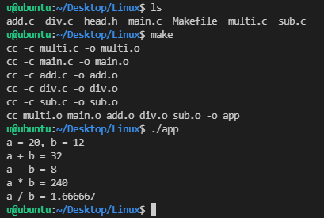

### 清除中间文件

```makefile
src=$(wildcard ./*.c)
objs=$(patsubst %.c, %.o, $(src))
target=app
$(target):$(objs)
	$(CC) $^ -o $@

%.o:%.c
	$(CC) -c $< -o $@

clean:
	rm *.o
```

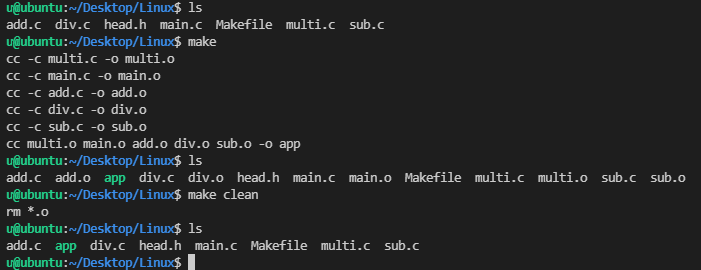

### 工作原理

- 命令在执行之前，需要先检查规则中的依赖是否存在
  - 如果存在，执行命令
  - 如果不存在，向下检查其它的规则，检查有没有一个规则是用来生成这个依赖的，如果找到了，则执行该规则中的命令
- 检测更新，在执行规则中的命令时，会比较目标和依赖文件的时间
  - 如果依赖的时间比目标的时间晚，需要重新生成目标
  - 如果依赖的时间比目标的时间早，目标不需要更新，对应规则中的命令不需要被执行

- 示例

  - 当修改`main.c`且重新`make`时，如下

    

  - 当不做任何修改且重新`make`时，如下

    

## GDB调试

### 说明

本部分笔记及源码出自`slide/01Linux系统编程入门/04 GDB调试`

### 概念

- `GDB` 是由 GNU 软件系统社区提供的调试工具，同 `GCC` 配套组成了一套完整的开发环境，`GDB` 是 Linux 和许多类 Unix 系统中的标准开发环境
- 一般来说，`GDB` 主要帮助你完成下面四个方面的功能
  - 启动程序，可以按照自定义的要求随心所欲的运行程序
  - 可让被调试的程序在所指定的调置的断点处停住（断点可以是条件表达式）
  - 当程序被停住时，可以检查此时程序中所发生的事
  - 可以改变程序，将一个 BUG 产生的影响修正从而测试其他 BUG

### 准备工作

- 使用以下命令编译：`gcc -g -Wall program.c -o program`
  - 通常，在为调试而编译时，我们会**关掉编译器的优化选项**（`-O`）， 并打开**调试选项**（`-g`）。另外，`-Wall`在尽量不影响程序行为的情况下选项打开所有warning，也可以发现许多问题，避免一些不必要的 BUG
  - `-g` 选项的作用是在可执行文件中加入源代码的信息，比如可执行文件中第几条机器指令对应源代码的第几行，但并不是把整个源文件嵌入到可执行文件中，所以在调试时必须保证 `gdb` 能找到源文件

- 注：当在 `gdb` 中直接使用`回车`时，会默认执行上一条命令

### 常用命令

#### 说明

- `启动与退出`至`查看当前文件代码`使用`test.c`
- 后续内容使用课件中其他源程序

#### 启动与退出

- 启动：`gdb 可执行程序`
- 退出：`quit/q`

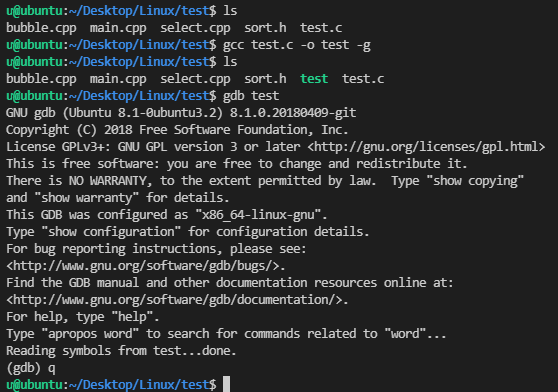

#### 给程序设置参数/获取设置参数

- 设置参数：`set args 10 20`
- 获取设置参数：`show args`

```c
// test.c 源码
#include <stdio.h>
#include <stdlib.h>

int test(int a);

int main(int argc, char* argv[]) {
    int a, b;
    printf("argc = %d\n", argc);

    if(argc < 3) {
        a = 10;
        b = 30;
    } else {
        a = atoi(argv[1]);
        b = atoi(argv[2]);
    }
    printf("a = %d, b = %d\n", a, b);
    printf("a + b = %d\n", a + b);

    for(int i = 0; i < a; ++i) {
        printf("i = %d\n", i);
        // 函数调用
        int res = test(i);
        printf("res value: %d\n", res);
    }

    printf("THE END !!!\n");
    return 0;
}

int test(int a) {
    int num = 0;
    for(int i = 0; i < a; ++i) {
        num += i;
    }
    return num;
}
```

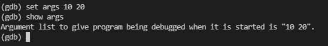

#### GDB使用帮助

- `help`

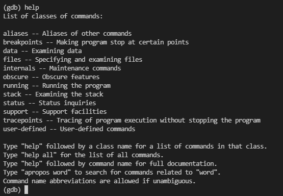

#### 查看当前文件代码

- 从默认位置显示：`list/l`

  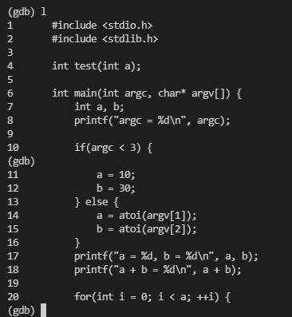

- 从指定的行显示：`list/l 行号`

  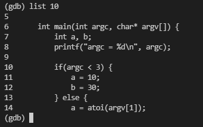

- 从指定的函数显示：`list/l 行号`

  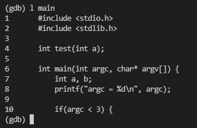

- 注：**查看时会显示前后文**

#### 查看非当前文件代码

- 编译运行并使用`gdb main`

  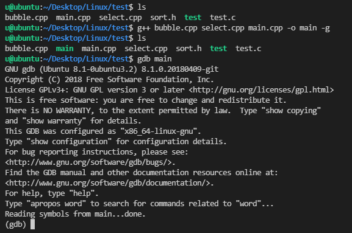

- 从指定文件指定的行显示：`list/l 文件名:行号`

  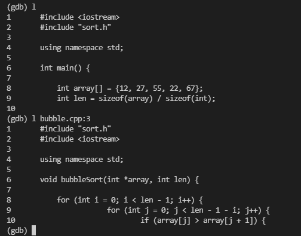

- 从指定文件指定的函数显示：`list/l 文件名:函数名`

  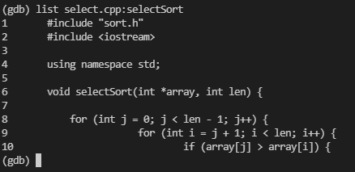

#### 查看及设置显示的行数

- 查看显示的行数：`show list/listsize`
- 设置显示的行数：`set list/listsize`

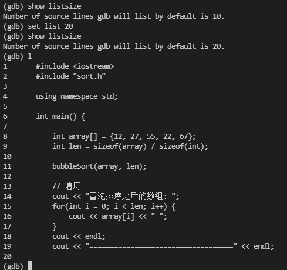

#### 断点操作

- 查看断点：`i/info b/break`

- 设置一般断点
  - `b/break 行号`
  - `b/break 函数名`
  - `b/break 文件名:行号`
  - `b/break 文件名:函数`
- 设置条件断点（一般用在循环的位置）：`b/break 10 if i==5`

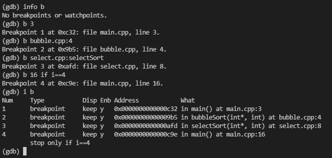

- 删除断点：`d/del/delete 断点编号`
- 设置断点无效：`dis/disable 断点编号`
- 设置断点生效：`ena/enable 断点编号`

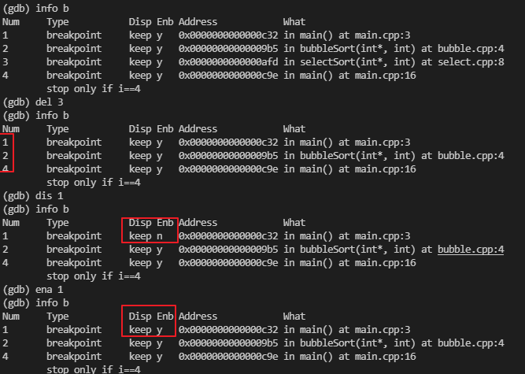

#### 调试操作

- 运行 `GDB` 程序
  - 程序停在第一行：`start`
  - 遇到断点才停：`run`
- 继续运行，到下一个断点停：`c/continue`
- 向下执行一行代码（不会进入函数体）：`n/next`
- 变量操作
  - 打印变量值：`p/print 变量名`
  - 打印变量类型：`ptype 变量名`
- 向下单步调试（遇到函数进入函数体）
  - `s/step`
  - 跳出函数体：`finish`
- 自动变量操作
  - 自动打印指定变量的值：`display 变量名`
  - 查看自动变量：`i/info display`
  - 取消自动变量：`undisplay 编号`
- 其它操作
  - 设置变量值：`set var 变量名=变量值 （循环中用的较多）`
  - 跳出循环：`until`

## 文件IO

### 说明

- 本部分笔记及源码出自`slide/01Linux系统编程入门/05 文件IO`

- 在`Linux`中使用`man 2 API名`查看**Linux系统API**，`man 3 API名`查看**标准C库API**

  - `man 2 open`

    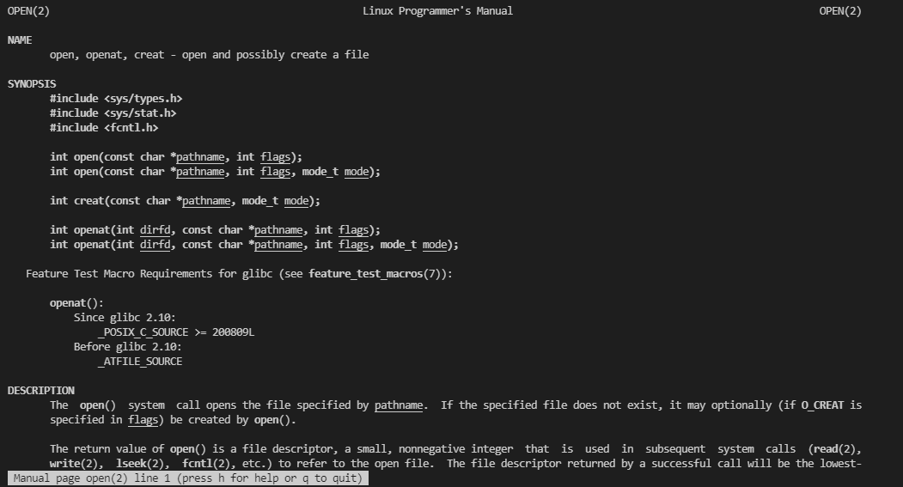

  - `man 3 fopen`

    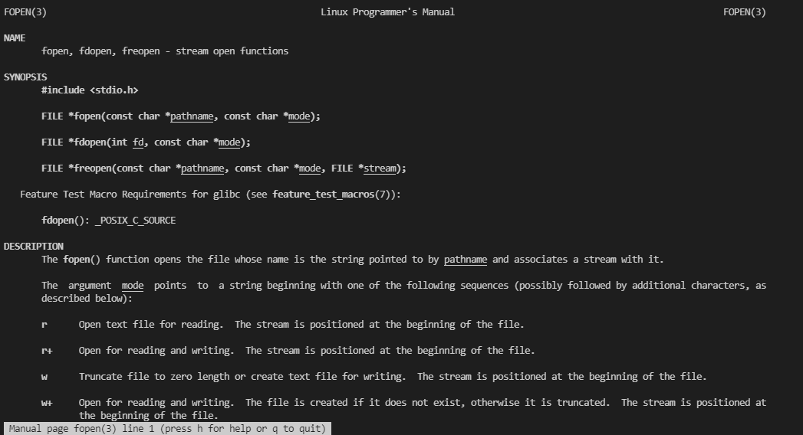

### 标准 C 库 IO 函数

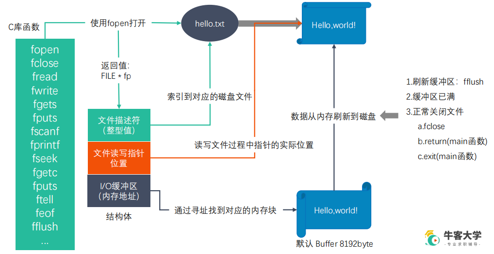

### 标准 C 库 IO 和 Linux 系统 IO 的关系

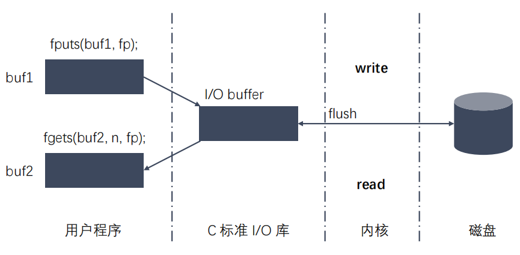

### 虚拟地址空间

- 虚拟地址空间是为了解决内存加载问题
  - 问题1：假设实际内存为`4G`，此时共有`1G`、`2G`、`2G`三个程序，如果直接加载，那么第三个程序由于内存不足而无法执行
  - 问题2：当问题1的`1G`程序执行完后，释放内存，第三个程序可以执行，但此时内存空间不连续

- 对于32位机器来说，大小约为$2^{32}$，即`4G`左右，对于64位机器来说，，大小约为$2^{48}$，即`256T`左右
- 通过`CPU中的MMU(内存管理单元)`将虚拟内存地址映射到物理内存地址上

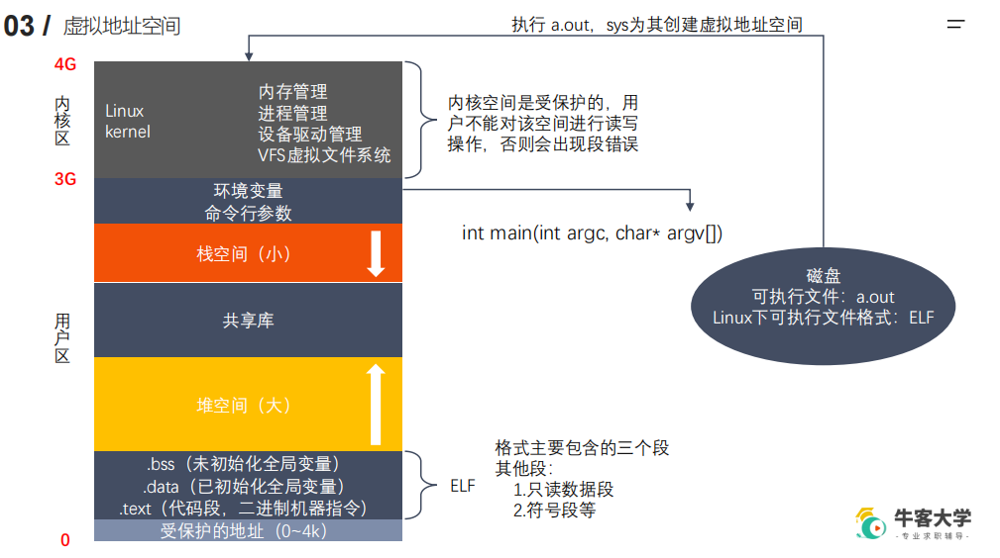

### 文件描述符

- 文件描述符表是一个**数组**，为了一个进程能够同时操作多个文件
- 文件描述符表默认大小：1024

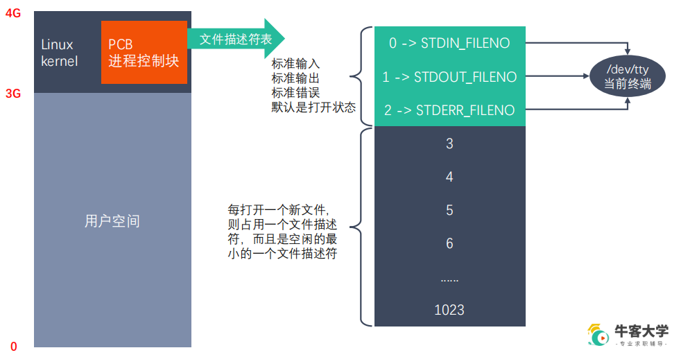

### Linux 系统 IO 函数

#### open & close

- `int open(const char *pathname, int flags);`，使用`man 2 open`查看帮助

  - 参数
    - `pathname`：要打开的文件路径
    - `flags`：对文件的操作权限设置还有其他的设置(`O_RDONLY,`  `O_WRONLY,`  `O_RDWR`  这三个设置是互斥的，代表只读，只写，可读可写)
  - 返回值：返回一个新的文件描述符，如果调用失败，返回-1，并设置`errno`，`errno`属于Linux系统函数库里面的一个全局变量，记录的是最近的错误号

  ```c
  /*
      #include <stdio.h>
      void perror(const char *s);作用：打印errno对应的错误描述
          参数s：用户描述，比如hello, 最终输出的内容是  hello:xxx(实际的错误描述)
  */
  
  #include <stdio.h>
  // 系统宏
  #include <sys/types.h>
  #include <sys/stat.h>
  // fopen函数声明头文件
  #include <fcntl.h>
  // close函数声明头文件
  #include <unistd.h>
  
  int main() 
  {
      // 打开一个文件
      int fd = open("a.txt", O_RDONLY);
  
      if(fd == -1) {
          perror("open");
      }
      // 读写操作
  
      // 关闭
      close(fd);
  
      return 0;
  }
  ```

- `int open(const char *pathname, int flags, mode_t mode);`，使用`man 2 open`查看帮助

  - 参数
    - `pathname`：要创建的文件的路径
    - `flags`：对文件的操作权限和其他的设置
      - 必选项：`O_RDONLY`,  `O_WRONLY`, `O_RDWR`  这三个之间是互斥的
      - 可选项：`O_CREAT` 文件不存在，创建新文件
      - `flags`参数是一个int类型的数据，占4个字节，32位，每一位就是一个标志位，所以用 `|` 可以保证能够实现多个操作
    - `mode`：八进制的数，表示创建出的新的文件的操作权限，比如：0775

  ```c
  /*
              最终的权限是：mode & ~umask
              0777   ->   111111111
          &   0775   ->   111111101
          ----------------------------
                          111111101
          按位与：0和任何数都为0
          umask的作用就是抹去某些权限, 可以直接在终端输入 umask 查看默认值
  */
  #include <sys/types.h>
  #include <sys/stat.h>
  #include <fcntl.h>
  #include <unistd.h>
  #include <stdio.h>
  
  int main() 
  {
      // 创建一个新的文件
      int fd = open("create.txt", O_RDWR | O_CREAT, 0777);
  
      if(fd == -1) {
          perror("open");
      }
  
      // 关闭
      close(fd);
  
      return 0;
  }
  ```

- `int close(int fd);`

#### read & write

- `ssize_t read(int fd, void *buf, size_t count);`，使用`man 2 read`查看帮助
  - 参数
    - `fd`：文件描述符，open得到的，通过这个文件描述符操作某个文件
    - `buf`：需要读取数据存放的地方，数组的地址（传出参数）
    - `count`：指定的数组的大小
  - 返回值
    - 成功
      - `> 0`: 返回实际的读取到的字节数
      - `= 0`：文件已经读取完了
    - 失败：-1
- `ssize_t write(int fd, const void *buf, size_t count);`，使用`man 2 write`查看帮助
  - 参数
    - `fd`：文件描述符，open得到的，通过这个文件描述符操作某个文件
    - `buf`：要往磁盘写入的数据
    - `count`：要写的数据的实际的大小
  - 返回值
    - 成功：实际写入的字节数
    - 失败：返回-1，并设置`errno`

```c
#include <unistd.h>
#include <stdio.h>
#include <sys/types.h>
#include <sys/stat.h>
#include <fcntl.h>

int main() 
{
    // 1.通过open打开english.txt文件
    int srcfd = open("english.txt", O_RDONLY);
    if(srcfd == -1) {
        perror("open");
        return -1;
    }

    // 2.创建一个新的文件（拷贝文件）
    int destfd = open("cpy.txt", O_WRONLY | O_CREAT, 0664);
    if(destfd == -1) {
        perror("open");
        return -1;
    }

    // 3.频繁的读写操作
    char buf[1024] = {0};
    int len = 0;
    while((len = read(srcfd, buf, sizeof(buf))) > 0) {
        write(destfd, buf, len);
    }

    // 4.关闭文件
    close(destfd);
    close(srcfd);


    return 0;
}
```

#### lseek

- `off_t lseek(int fd, off_t offset, int whence);`，使用`man 2 lseek`查看帮助

```c
/*  
    标准C库的函数
    #include <stdio.h>
    int fseek(FILE *stream, long offset, int whence);

    Linux系统函数
    #include <sys/types.h>
    #include <unistd.h>
    off_t lseek(int fd, off_t offset, int whence);
        参数：
            - fd：文件描述符，通过open得到的，通过这个fd操作某个文件
            - offset：偏移量
            - whence:
                SEEK_SET
                    设置文件指针的偏移量
                SEEK_CUR
                    设置偏移量：当前位置 + 第二个参数offset的值
                SEEK_END
                    设置偏移量：文件大小 + 第二个参数offset的值
        返回值：返回文件指针的位置

    作用：
        1.移动文件指针到文件头
        lseek(fd, 0, SEEK_SET);

        2.获取当前文件指针的位置
        lseek(fd, 0, SEEK_CUR);

        3.获取文件长度
        lseek(fd, 0, SEEK_END);

        4.拓展文件的长度，当前文件10b, 110b, 增加了100个字节
        lseek(fd, 100, SEEK_END)
        注意：需要写一次数据

*/

#include <sys/types.h>
#include <sys/stat.h>
#include <fcntl.h>
#include <unistd.h>
#include <stdio.h>

int main() 
{
    int fd = open("hello.txt", O_RDWR);

    if(fd == -1) {
        perror("open");
        return -1;
    }

    // 扩展文件的长度
    int ret = lseek(fd, 100, SEEK_END);
    if(ret == -1) {
        perror("lseek");
        return -1;
    }

    // 写入一个空数据，如果缺少，那么会扩展失败
    write(fd, " ", 1);

    // 关闭文件
    close(fd);

    return 0;
}

```

- 扩展前

  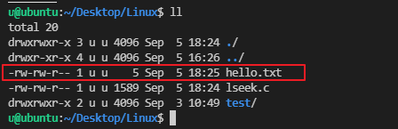

- 扩展后（原先为5个字节，扩展100个字节，然后写入一个字节）

  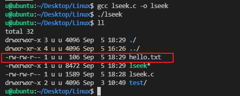

#### stat & lstat(获取文件信息及软链接信息)

- `int stat(const char *pathname, struct stat *statbuf);`，使用`man 2 stat`查看帮助

- `int lstat(const char *pathname, struct stat *statbuf);`，使用`man 2 lstat`查看帮助

- Linux命令：`stat`

  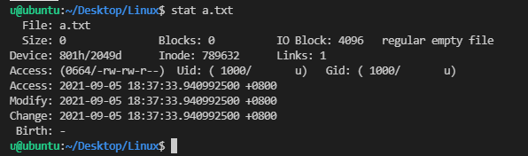

- `stat`结构体

  ```c
  struct stat {
      dev_t st_dev; // 文件的设备编号
      ino_t st_ino; // 节点
      mode_t st_mode; // 文件的类型和存取的权限
      nlink_t st_nlink; // 连到该文件的硬连接数目
      uid_t st_uid; // 用户ID
      gid_t st_gid; // 组ID
      dev_t st_rdev; // 设备文件的设备编号
      off_t st_size; // 文件字节数(文件大小)
      blksize_t st_blksize; // 块大小
      blkcnt_t st_blocks; // 块数
      time_t st_atime; // 最后一次访问时间
      time_t st_mtime; // 最后一次修改时间
      time_t st_ctime; // 最后一次改变时间(指属性)
  };
  ```

  - `st_mode`

    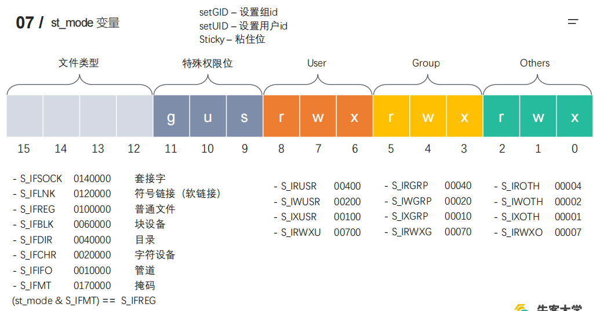

```c
/*
    #include <sys/types.h>
    #include <sys/stat.h>
    #include <unistd.h>

    int stat(const char *pathname, struct stat *statbuf);
        作用：获取一个文件相关的一些信息
        参数:
            - pathname：操作的文件的路径
            - statbuf：结构体变量，传出参数，用于保存获取到的文件的信息
        返回值：
            成功：返回0
            失败：返回-1 设置errno

    int lstat(const char *pathname, struct stat *statbuf);
        参数:
            - pathname：操作的文件的路径
            - statbuf：结构体变量，传出参数，用于保存获取到的文件的信息
        返回值：
            成功：返回0
            失败：返回-1 设置errno

*/

#include <sys/types.h>
#include <sys/stat.h>
#include <unistd.h>
#include <stdio.h>

int main() 
{
    struct stat statbuf;

    int ret = stat("a.txt", &statbuf);

    if(ret == -1) {
        perror("stat");
        return -1;
    }

    printf("size: %ld\n", statbuf.st_size);


    return 0;
}
```

#### 模拟实现`ls -l`

```c
#include <stdio.h>
#include <sys/types.h>
#include <sys/stat.h>
#include <unistd.h>
#include <pwd.h>        // for getpwuid()
#include <grp.h>        // for getgrgid()
#include <time.h>       // for ctime()
#include <string.h>     // for strncpy(), strlen()

// 模拟实现 ls -l 指令
// -rw-rw-r-- 1 nowcoder nowcoder 12 12月  3 15:48 a.txt
int main(int argc, char * argv[]) 
{
    // 判断输入的参数是否正确
    if(argc < 2) {
        printf("%s filename\n", argv[0]);
        return -1;
    }

    // 通过stat函数获取用户传入的文件的信息
    struct stat st;
    int ret = stat(argv[1], &st);
    if(ret == -1) {
        perror("stat");
        return -1;
    }

    // 获取文件类型和文件权限
    char perms[11] = {0};   // 用于保存文件类型和文件权限的字符串

    switch(st.st_mode & S_IFMT) {
        case S_IFLNK:
            perms[0] = 'l';
            break;
        case S_IFDIR:
            perms[0] = 'd';
            break;
        case S_IFREG:
            perms[0] = '-';
            break; 
        case S_IFBLK:
            perms[0] = 'b';
            break; 
        case S_IFCHR:
            perms[0] = 'c';
            break; 
        case S_IFSOCK:
            perms[0] = 's';
            break;
        case S_IFIFO:
            perms[0] = 'p';
            break;
        default:
            perms[0] = '?';
            break;
    }

    // 判断文件的访问权限

    // 文件所有者
    perms[1] = (st.st_mode & S_IRUSR) ? 'r' : '-';
    perms[2] = (st.st_mode & S_IWUSR) ? 'w' : '-';
    perms[3] = (st.st_mode & S_IXUSR) ? 'x' : '-';

    // 文件所在组
    perms[4] = (st.st_mode & S_IRGRP) ? 'r' : '-';
    perms[5] = (st.st_mode & S_IWGRP) ? 'w' : '-';
    perms[6] = (st.st_mode & S_IXGRP) ? 'x' : '-';

    // 其他人
    perms[7] = (st.st_mode & S_IROTH) ? 'r' : '-';
    perms[8] = (st.st_mode & S_IWOTH) ? 'w' : '-';
    perms[9] = (st.st_mode & S_IXOTH) ? 'x' : '-';

    // 硬连接数
    int linkNum = st.st_nlink;

    // 文件所有者
    char* fileUser = getpwuid(st.st_uid)->pw_name;

    // 文件所在组
    char* fileGrp = getgrgid(st.st_gid)->gr_name;

    // 文件大小
    long int fileSize = st.st_size;

    // 获取修改的时间
    char* time = ctime(&st.st_mtime);

    char mtime[512] = {0};
    strncpy(mtime, time, strlen(time) - 1);

    char buf[1024];
    sprintf(buf, "%s %d %s %s %ld %s %s", perms, linkNum, fileUser, fileGrp, fileSize, mtime, argv[1]);

    printf("%s\n", buf);

    return 0;
}
```

### 文件属性操作函数

#### access

- `int access(const char *pathname, int mode);`

```c
/*
    #include <unistd.h>
    int access(const char *pathname, int mode);
        作用：判断某个文件是否有某个权限，或者判断文件是否存在
        参数：
            - pathname: 判断的文件路径
            - mode:
                R_OK: 判断是否有读权限
                W_OK: 判断是否有写权限
                X_OK: 判断是否有执行权限
                F_OK: 判断文件是否存在
        返回值：成功返回0， 失败返回-1
*/

#include <unistd.h>
#include <stdio.h>

int main() 
{
    int ret = access("a.txt", F_OK);
    if(ret == -1) {
        perror("access");
    }

    printf("文件存在！！!\n");

    return 0;
}
```

#### chmod & chown

- `int chmod(const char *filename, int mode);`

```c
/*
    #include <sys/stat.h>
    int chmod(const char *pathname, mode_t mode);
        修改文件的权限
        参数：
            - pathname: 需要修改的文件的路径
            - mode:需要修改的权限值，八进制的数
        返回值：成功返回0，失败返回-1

*/
#include <sys/stat.h>
#include <stdio.h>
int main() 
{
    int ret = chmod("a.txt", 0777);

    if(ret == -1) {
        perror("chmod");
        return -1;
    }

    return 0;
}
```

- `int chown(const char *path, uid_t owner, gid_t group);`
  - 修改文件所有者
  - 可使用`vim /etc/passwd`查看有哪些用户
  - 可使用`vim /etc/group`查看有哪些组

#### truncate

- `int truncate(const char *path, off_t length);`

```c
/*
    #include <unistd.h>
    #include <sys/types.h>
    int truncate(const char *path, off_t length);
        作用：缩减或者扩展文件的尺寸至指定的大小
        参数：
            - path: 需要修改的文件的路径
            - length: 需要最终文件变成的大小
        返回值：
            成功返回0， 失败返回-1
*/

#include <unistd.h>
#include <sys/types.h>
#include <stdio.h>

int main() 
{
    int ret = truncate("b.txt", 5);

    if(ret == -1) {
        perror("truncate");
        return -1;
    }

    return 0;
}
```

### 目录操作函数

#### mkdir

- `int mkdir(const char *pathname, mode_t mode);`

```c
/*
    #include <sys/stat.h>
    #include <sys/types.h>
    int mkdir(const char *pathname, mode_t mode);
        作用：创建一个目录
        参数：
            pathname: 创建的目录的路径
            mode: 权限，八进制的数
        返回值：
            成功返回0， 失败返回-1
*/

#include <sys/stat.h>
#include <sys/types.h>
#include <stdio.h>

int main() 
{
    int ret = mkdir("aaa", 0777);

    if(ret == -1) {
        perror("mkdir");
        return -1;
    }

    return 0;
}
```

#### rename

- `int rename(const char *oldpath, const char *newpath);`

```c
/*
    #include <stdio.h>
    int rename(const char *oldpath, const char *newpath);

*/
#include <stdio.h>

int main() 
{
    int ret = rename("aaa", "bbb");

    if(ret == -1) {
        perror("rename");
        return -1;
    }

    return 0;
}
```

#### chdir & getcwd

- `int chdir(const char *path);`

- `char *getcwd(char *buf, size_t size);`

```c
/*

    #include <unistd.h>
    int chdir(const char *path);
        作用：修改进程的工作目录
            比如在/home/nowcoder 启动了一个可执行程序a.out, 进程的工作目录 /home/nowcoder
        参数：
            path : 需要修改的工作目录

    #include <unistd.h>
    char *getcwd(char *buf, size_t size);
        作用：获取当前工作目录
        参数：
            - buf : 存储的路径，指向的是一个数组（传出参数）
            - size: 数组的大小
        返回值：
            返回的指向的一块内存，这个数据就是第一个参数

*/
#include <unistd.h>
#include <stdio.h>
#include <sys/stat.h>
#include <sys/types.h>
#include <fcntl.h>

int main() 
{
    // 获取当前的工作目录
    char buf[128];
    getcwd(buf, sizeof(buf));
    printf("当前的工作目录是：%s\n", buf);

    // 修改工作目录
    int ret = chdir("/home/u/Desktop/Linux/test");
    if(ret == -1) {
        perror("chdir");
        return -1;
    } 

    // 创建一个新的文件
    int fd = open("chdir.txt", O_CREAT | O_RDWR, 0664);
    if(fd == -1) {
        perror("open");
        return -1;
    }

    close(fd);

    // 获取当前的工作目录
    char buf1[128];
    getcwd(buf1, sizeof(buf1));
    printf("当前的工作目录是：%s\n", buf1);
    
    return 0;
}
```

### 目录遍历函数

- 打开一个目录：`DIR *opendir(const char *name);`

- 读取目录中的数据：`struct dirent *readdir(DIR *dirp);`

- 关闭目录：`int closedir(DIR *dirp);`

- `dirent` 结构体和 `d_type`

  ```c
  struct dirent
  {
      // 此目录进入点的inode
      ino_t d_ino; 
      // 目录文件开头至此目录进入点的位移
      off_t d_off; 
      // d_name 的长度, 不包含NULL字符
      unsigned short int d_reclen; 
      // d_name 所指的文件类型
      unsigned char d_type; 
      // 文件名
      char d_name[256];
  };
  ```

  - `d_type`

    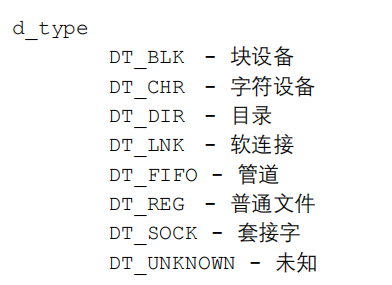

- **读取文件夹文件数目**实例

  ```c
  /*
      // 打开一个目录
      #include <sys/types.h>
      #include <dirent.h>
      DIR *opendir(const char *name);
          参数：
              - name: 需要打开的目录的名称
          返回值：
              DIR * 类型，理解为目录流
              错误返回NULL
  
  
      // 读取目录中的数据
      #include <dirent.h>
      struct dirent *readdir(DIR *dirp);
          - 参数：dirp是opendir返回的结果
          - 返回值：
              struct dirent，代表读取到的文件的信息
              读取到了末尾或者失败了，返回NULL
  
      // 关闭目录
      #include <sys/types.h>
      #include <dirent.h>
      int closedir(DIR *dirp);
  
  */
  #include <sys/types.h>
  #include <dirent.h>
  #include <stdio.h>
  #include <string.h>
  #include <stdlib.h>
  
  int getFileNum(const char * path);
  
  // 读取某个目录下所有的普通文件的个数
  int main(int argc, char * argv[]) 
  {
      if(argc < 2) {
          printf("%s path\n", argv[0]);
          return -1;
      }
  
      int num = getFileNum(argv[1]);
  
      printf("普通文件的个数为：%d\n", num);
  
      return 0;
  }
  
  // 用于获取目录下所有普通文件的个数
  int getFileNum(const char * path) {
  
      // 1.打开目录
      DIR * dir = opendir(path);
  
      if(dir == NULL) {
          perror("opendir");
          exit(0);
      }
  
      struct dirent *ptr;
  
      // 记录普通文件的个数
      int total = 0;
  
      while((ptr = readdir(dir)) != NULL) {
  
          // 获取名称
          char * dname = ptr->d_name;
  
          // 忽略掉. 和..
          if(strcmp(dname, ".") == 0 || strcmp(dname, "..") == 0) {
              continue;
          }
  
          // 判断是否是普通文件还是目录
          if(ptr->d_type == DT_DIR) {
              // 目录,需要继续读取这个目录
              char newpath[256];
              sprintf(newpath, "%s/%s", path, dname);
              total += getFileNum(newpath);
          }
  
          if(ptr->d_type == DT_REG) {
              // 普通文件
              total++;
          }
      }
  
      // 关闭目录
      closedir(dir);
  
      return total;
  }
  ```

### 文件描述符之`dup`、`dup2`

#### dup

- `int dup(int oldfd);`
- 复制文件描述符

```c
/*
    #include <unistd.h>
    int dup(int oldfd);
        作用：复制一个新的文件描述符
        fd=3, int fd1 = dup(fd),
        fd指向的是a.txt, fd1也是指向a.txt
        从空闲的文件描述符表中找一个最小的，作为新的拷贝的文件描述符


*/

#include <unistd.h>
#include <stdio.h>
#include <fcntl.h>
#include <sys/types.h>
#include <sys/stat.h>
#include <string.h>

int main() 
{
    int fd = open("a.txt", O_RDWR | O_CREAT, 0664);

    int fd1 = dup(fd);

    if(fd1 == -1) {
        perror("dup");
        return -1;
    }

    printf("fd : %d , fd1 : %d\n", fd, fd1);

    close(fd);

    char * str = "hello,world";
    int ret = write(fd1, str, strlen(str));
    if(ret == -1) {
        perror("write");
        return -1;
    }

    close(fd1);

    return 0;
}
```

#### dup2

- `int dup2(int oldfd, int newfd);`
- 重定向文件描述符

```c
/*
    #include <unistd.h>
    int dup2(int oldfd, int newfd);
        作用：重定向文件描述符
        oldfd 指向 a.txt, newfd 指向 b.txt
        调用函数成功后：newfd 和 b.txt 做close, newfd 指向了 a.txt
        oldfd 必须是一个有效的文件描述符
        oldfd和newfd值相同，相当于什么都没有做
*/
#include <unistd.h>
#include <stdio.h>
#include <string.h>
#include <sys/stat.h>
#include <sys/types.h>
#include <fcntl.h>

int main() 
{
    int fd = open("1.txt", O_RDWR | O_CREAT, 0664);
    if(fd == -1) {
        perror("open");
        return -1;
    }

    int fd1 = open("2.txt", O_RDWR | O_CREAT, 0664);
    if(fd1 == -1) {
        perror("open");
        return -1;
    }

    printf("fd : %d, fd1 : %d\n", fd, fd1);

    int fd2 = dup2(fd, fd1);
    if(fd2 == -1) {
        perror("dup2");
        return -1;
    }

    // 通过fd1去写数据，实际操作的是1.txt，而不是2.txt
    char * str = "hello, dup2";
    int len = write(fd1, str, strlen(str));

    if(len == -1) {
        perror("write");
        return -1;
    }

    printf("fd : %d, fd1 : %d, fd2 : %d\n", fd, fd1, fd2);

    close(fd);
    close(fd1);

    return 0;
}
```

### fcntl 函数

- `int fcntl(int fd, int cmd, ... /* arg */ );`
- **复制文件描述符**和**设置/获取文件的状态标志**

```c
/*

    #include <unistd.h>
    #include <fcntl.h>

    int fcntl(int fd, int cmd, ...);
    参数：
        fd : 表示需要操作的文件描述符
        cmd: 表示对文件描述符进行如何操作
            - F_DUPFD : 复制文件描述符,复制的是第一个参数fd，得到一个新的文件描述符（返回值）
                int ret = fcntl(fd, F_DUPFD);

            - F_GETFL : 获取指定的文件描述符文件状态flag
              获取的flag和我们通过open函数传递的flag是一个东西。

            - F_SETFL : 设置文件描述符文件状态flag
              必选项：O_RDONLY, O_WRONLY, O_RDWR 不可以被修改
              可选性：O_APPEND, O_NONBLOCK
                O_APPEND 表示追加数据
                NONBLOK 设置成非阻塞
        
        阻塞和非阻塞：描述的是函数调用的行为。
*/

#include <unistd.h>
#include <fcntl.h>
#include <stdio.h>
#include <string.h>

int main() 
{
    // 1.复制文件描述符
    // int fd = open("1.txt", O_RDONLY);
    // int ret = fcntl(fd, F_DUPFD);

    // 2.修改或者获取文件状态flag
    int fd = open("1.txt", O_RDWR);
    if(fd == -1) {
        perror("open");
        return -1;
    }

    // 获取文件描述符状态flag
    int flag = fcntl(fd, F_GETFL);
    if(flag == -1) {
        perror("fcntl");
        return -1;
    }
    flag |= O_APPEND;   // flag = flag | O_APPEND

    // 修改文件描述符状态的flag，给flag加入O_APPEND这个标记
    int ret = fcntl(fd, F_SETFL, flag);
    if(ret == -1) {
        perror("fcntl");
        return -1;
    }

    char * str = "nihao";
    write(fd, str, strlen(str));

    close(fd);

    return 0;
}
```


