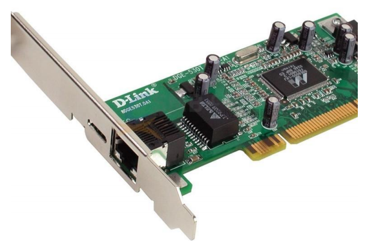
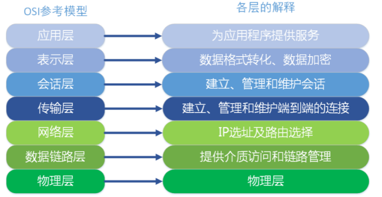
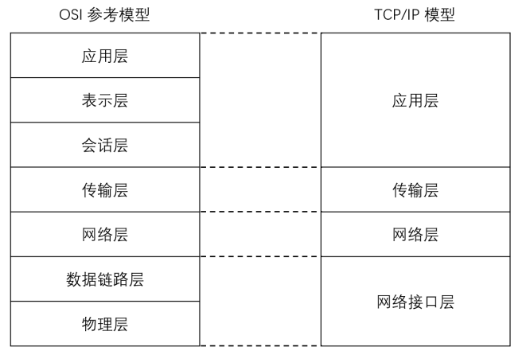

# 网络基础

## 网络结构模式

### C/S结构

#### 简介

- 服务器 - 客户机，即 `Client - Server（C/S）`结构。C/S 结构通常采取两层结构。服务器负责数据的管理，客户机负责完成与用户的交互任务。客户机是因特网上访问别人信息的机器，服务器则是提供信息供人访问的计算机。

- 客户机通过局域网与服务器相连，接受用户的请求，并通过网络向服务器提出请求，对数据库进行操作。服务器接受客户机的请求，将数据提交给客户机，客户机将数据进行计算并将结果呈现给用户。服务器还要提供完善安全保护及对数据完整性的处理等操作，并允许多个客户机同时访问服务器，这就对服务器的硬件处理数据能力提出了很高的要求。

- 在C/S结构中，应用程序分为两部分：服务器部分和客户机部分。服务器部分是多个用户共享的信息与功能，执行后台服务，如控制共享数据库的操作等；客户机部分为用户所专有，负责执行前台功能，在出错提示、在线帮助等方面都有强大的功能，并且可以在子程序间自由切换。

#### 优点

- 能充分发挥客户端 PC 的处理能力，很多工作可以在客户端处理后再提交给服务器，所以 C/S 结构客户端响应速度快
- 操作界面漂亮、形式多样，可以充分满足客户自身的个性化要求
- C/S 结构的管理信息系统具有较强的事务处理能力，能实现复杂的业务流程
- 安全性较高，C/S 一般面向相对固定的用户群，程序更加注重流程，它可以对权限进行多层次校验，提供了更安全的存取模式，对信息安全的控制能力很强，一般高度机密的信息系统采用 C/S 结构适宜

#### 缺点

- 客户端需要安装专用的客户端软件。首先涉及到安装的工作量，其次任何一台电脑出问题，如病毒、硬件损坏，都需要进行安装或维护。系统软件升级时，每一台客户机需要重新安装，其维护和升级成本非常高
- 对客户端的操作系统一般也会有限制，不能够跨平台

### B/S结构

#### 简介

- `B/S 结构（Browser/Server，浏览器/服务器模式）`，是 WEB 兴起后的一种网络结构模式，WEB浏览器是客户端最主要的应用软件。这种模式统一了客户端，将系统功能实现的核心部分集中到服务器上，简化了系统的开发、维护和使用。

- 客户机上只要安装一个浏览器，如 Firefox 或 InternetExplorer，服务器安装 SQL Server、Oracle、MySQL 等数据库。浏览器通过 Web Server 同数据库进行数据交互

#### 优点

- B/S 架构最大的优点是总体拥有成本低、维护方便、 分布性强、开发简单，可以不用安装任何专门的软件就能实现在任何地方进行操作，客户端零维护，系统的扩展非常容易，只要有一台能上网的电脑就能使用

#### 缺点

- 通信开销大、系统和数据的安全性较难保障
- 个性特点明显降低，无法实现具有个性化的功能要求
- 协议一般是固定的：http/https
- 客户端服务器端的交互是请求-响应模式，通常动态刷新页面，响应速度明显降低

## MAC地址

### 网卡

- `网卡`是一块被设计用来允许计算机在计算机网络上进行通讯的计算机硬件，又称为`网络适配器`或`网络接口卡NIC`。其拥有 MAC 地址，属于 `OSI` 模型的第 2 层，它使得用户可以通过电缆或无线相互连接。

- 每一个网卡都有一个被称为 MAC 地址的独一无二的 **48 位串行号**

- 网卡的主要功能：1.数据的封装与解封装、2.链路管理、3.数据编码与译码

### MAC地址

- `MAC 地址（Media Access Control Address）`，直译为媒体存取控制位址，也称为局域网地址、以太网地址、物理地址或硬件地址，它是一个用来确认网络设备位置的位址，由网络设备制造商生产时烧录在网卡中

- 在 `OSI` 模型中，**第三层网络层负责 IP 地址**，**第二层数据链路层则负责 MAC位址** 

- MAC 地址用于在网络中唯一标识一个网卡，一台设备若有一或多个网卡，则每个网卡都需要并会有一个唯一的 MAC 地址

## IP地址

### 简介

- `IP 协议`是为计算机网络相互连接进行通信而设计的协议。在因特网中，它是**能使连接到网上的所有计算机网络实现相互通信的一套规则，规定了计算机在因特网上进行通信时应当遵守的规则**。任何厂家生产的计算机系统，只要遵守 `IP 协议`就可以与因特网互连互通。各个厂家生产的网络系统和设备，如以太网、分组交换网等，它们相互之间不能互通，**不能互通的主要原因是因为它们所传送数据的基本单元（技术上称之为“帧”）的格式不同**

- `IP 协议`实际上是一套由软件程序组成的协议软件，它把各种不同“帧”统一转换成`IP 数据报`格式，这种转换是因特网的一个最重要的特点，使所有各种计算机都能在因特网上实现互通，即具有“开放性”的特点。正是因为有了 IP 协议，因特网才得以迅速发展成为世界上最大的、开放的计算机通信网络。因此，IP 协议也可以叫做“因特网协议”

- IP 地址（Internet Protocol Address）是指互联网协议地址，又译为网际协议地址。

- IP 地址是 IP协议提供的一种统一的地址格式，它为互联网上的每一个网络和每一台主机分配一个逻辑地址，以此来屏蔽物理地址的差异

- **IP 地址是一个 32 位的二进制数，通常被分割为 4 个“ 8 位二进制数”（也就是 4 个字节）**

- IP 地址通常用`点分十进制`表示成（`a.b.c.d`）的形式，其中，a,b,c,d都是 0~255 之间的十进制整数。例：点分十进IP地址（100.4.5.6），实际上是 32 位二进制数（01100100.00000100.00000101.00000110）

### **IP** 地址编址方式

- 最初设计互联网络时，**为了便于寻址以及层次化构造网络，每个 IP 地址包括两个标识码（ID）**，即`网络ID` 和`主机 ID`。同一个物理网络上的所有主机都使用同一个网络 ID，网络上的一个主机（包括网络上工作站，服务器和路由器等）有一个主机 ID 与其对应
- Internet 委员会定义了 5 种 IP 地址类型以适合不同容量的网络，即 A 类~ E 类

- 其中 A、B、C 3类（如下表格）由 InternetNIC 在全球范围内统一分配，D、E 类为特殊地址
  - A类最高位不能为1，所以是$2^7$
  - 主机数要减去2是因为去掉`x.x.x.0`和`x.x.x.255`这两个特殊的地址

| 类别 |    最大网络数     |        IP地址范围         |  单个网段最大主机数  |       私有IP地址范围        |
| :--: | :---------------: | :-----------------------: | :------------------: | :-------------------------: |
|  A   |   126($2^7-1$)    |  1.0.0.1~126.255.255.254  | 16777214($2^{24}-2$) |   10.0.0.0~10.255.255.255   |
|  B   |  16384($2^{14}$)  | 128.0.0.1~191.255.255.254 |  65534($2^{16}-2$)   |  172.16.0.0~172.31.255.255  |
|  C   | 2097152($2^{21}$) | 192.0.0.1~223.255.255.254 |     254($2^8-2$)     | 192.168.0.0~192.168.255.255 |

### A类IP地址

- 一个 A 类 IP 地址是指， 在 IP 地址的四段号码中，**第一段号码为网络号码，剩下的三段号码为本地计算机的号码**
- 如果用二进制表示 IP 地址的话，A 类 IP 地址就由 1 字节的网络地址和 3 字节主机地址组成，**网络地址的最高位必须是`0`**
- A 类 IP 地址中网络的标识长度为 8 位，主机标识的长度为 24 位，A类网络地址数量较少，有 126 个网络，每个网络可以容纳主机数达 1600 多万台

- A 类 IP 地址 地址范围 `1.0.0.1 - 126.255.255.254`（二进制表示为：`00000001 00000000 00000000 00000001 - 01111111 11111111 11111111 11111110`），最后一个是广播地址
- A 类 IP 地址的子网掩码为 255.0.0.0，每个网络支持的最大主机数为$2^{24}-2$

### B类IP地址

- 一个 B 类 IP 地址是指，在 IP 地址的四段号码中，**前两段号码为网络号码，剩下的两段号码为本地计算机的号码**
- 如果用二进制表示 IP 地址的话，B 类 IP 地址就由 2 字节的网络地址和 2 字节主机地址组成，**网络地址的最高位必须是`10`**
- B 类 IP地址中网络的标识长度为 16 位，主机标识的长度为 16 位，B 类网络地址适用于中等规模的网络，有16384 个网络，每个网络所能容纳的计算机数为 6 万多台
- B 类 IP 地址地址范围 `128.0.0.1 - 191.255.255.254` （二进制表示为：`10000000 00000000 00000000 00000001 - 10111111 11111111 11111111 11111110`）， 最后一个是广播地址
- B 类 IP 地址的子网掩码为 255.255.0.0，每个网络支持的最大主机数为$2^{16}-2$

### C类IP地址

- 一个 C 类 IP 地址是指，在 IP 地址的四段号码中，**前三段号码为网络号码，剩下的一段号码为本地计算机的号码**
- 如果用二进制表示 IP 地址的话，C 类 IP 地址就由 3 字节的网络地址和 1 字节主机地址组成，**网络地址的最高位必须是`110`**
- C 类 IP 地址中网络的标识长度为 24 位，主机标识的长度为 8 位，C 类网络地址数量较多，有 209 万余个网络。适用于小规模的局域网络，每个网络最多只能包含254台计算机
- C 类 IP 地址范围 `192.0.0.1-223.255.255.254` （二进制表示为: `11000000 00000000 00000000 00000001 - 11011111 11111111 11111111 11111110`），最后一个是广播地址
- C类IP地址的子网掩码为 255.255.255.0，每个网络支持的最大主机数为$2^8-2$

### D类IP地址

- D 类 IP 地址在历史上被叫做`多播地址（multicast address）`，即`组播地址`
- 在以太网中，多播地址命名了一组应该在这个网络中应用接收到一个分组的站点。多播地址的最高位必须是 `1110`，范围从`224.0.0.0 - 239.255.255.255`

### 特殊的网址

- 每一个字节都为 0 的地址（ `0.0.0.0` ）对应于**当前主机**
- IP 地址中的每一个字节都为 1 的 IP 地址（ `255.255.255.255` ）是**当前子网的广播地址**

- IP 地址中凡是以 `11110` 开头的 E 类 IP 地址都保留用于将来和实验使用
- IP地址中**不能以十进制 `127` 作为开头**，该类地址中数字 `127.0.0.1 ~ 127.255.255.255` 用于回路测试，如：`127.0.0.1`可以代表**本机IP地址**

### 子网掩码

- `子网掩码（subnet mask）`又叫网络掩码、地址掩码、子网络遮罩，它是一种用来指明一个 IP 地址的哪些位标识的是主机所在的子网，以及哪些位标识的是主机的位掩码
- 子网掩码不能单独存在，它必须结合 IP 地址一起使用
- 子网掩码只有一个作用，就是将某个 IP 地址划分成`网络地址`和`主机地址`两部分
- 子网掩码是一个 **32 位地址**，用于屏蔽 IP 地址的一部分以区别网络标识和主机标识，并说明该 IP地址是在局域网上，还是在广域网上

> 子网掩码是在 IPv4 地址资源紧缺的背景下为了解决 lP 地址分配而产生的虚拟 lP 技术，通过子网掩码将A、B、C 三类地址划分为若干子网，从而显著提高了 IP 地址的分配效率，有效解决了 IP 地址资源紧张的局面。另一方面，在企业内网中为了更好地管理网络，网管人员也利用子网掩码的作用，人为地将一个较大的企业内部网络划分为更多个小规模的子网，再利用三层交换机的路由功能实现子网互联，从而有效解决了网络广播风暴和网络病毒等诸多网络管理方面的问题
>
> 在大多数的网络教科书中，一般都将子网掩码的作用描述为通过逻辑运算，将 IP 地址划分为网络标识(Net.ID) 和主机标识(Host.ID)，只有网络标识相同的两台主机在无路由的情况下才能相互通信
>
> 根据 RFC950 定义，子网掩码是一个 32 位的 2 进制数， 其对应网络地址的所有位都置为 1，对应于主机地址的所有位置都为 0。子网掩码告知路由器，地址的哪一部分是网络地址，哪一部分是主机地址，使路由器正确判断任意 IP 地址是否是本网段的，从而正确地进行路由。网络上，数据从一个地方传到另外一个地方，是依靠 IP 寻址。从逻辑上来讲，是两步的。第一步，从 IP 中找到所属的网络，好比是去找这个人是哪个小区的；第二步，再从 IP 中找到主机在这个网络中的位置，好比是在小区里面找到这个人
>
> 子网掩码的设定必须遵循一定的规则。与二进制 IP 地址相同，子网掩码由 1 和 0 组成，且 1 和 0 分别连续。子网掩码的长度也是 32 位，左边是网络位，用二进制数字 “1” 表示，1 的数目等于网络位的长度；右边是主机位，用二进制数字 “0” 表示，0 的数目等于主机位的长度。这样做的目的是为了让掩码与 IP 地址做按位与运算时用 0 遮住原主机数，而不改变原网络段数字，而且很容易通过 0 的位数确定子网的主机数（ 2 的主机位数次方 - 2，因为主机号全为 1 时表示该网络广播地址，全为 0 时表示该网络的网络号，这是两个特殊地址）。通过子网掩码，才能表明一台主机所在的子网与其他子网的关系，使网络正常工作

## 端口

### 简介

- `端口` 是英文 port 的意译，可以认为是设备与外界通讯交流的出口
- 端口可分为`虚拟端口`和`物理端口`
  - 虚拟端口指计算机内部或交换机路由器内的端口，不可见，是特指TCP/IP协议中的端口，是逻辑意义上的端口，例如计算机中的 80 端口、21 端口、23 端口等
  - 物理端口又称为接口，是可见端口，计算机背板的 RJ45 网口，交换机路由器集线器等 RJ45 端口。电话使用 RJ11 插口也属于物理端口的范畴

- 端口是通过端口号来标记的，端口号只有整数，范围是从 0 到65535（$2^{16}$）

### 端口类型

#### 周知端口（Well Known Ports）

- 周知端口是众所周知的端口号，也叫知名端口、公认端口或者常用端口，**范围从 0 到 1023**，它们紧密绑定于一些特定的服务，例如 80 端口分配给 WWW 服务，21 端口分配给 FTP 服务，23 端口分配给Telnet服务等等

- 我们在 IE 的地址栏里输入一个网址的时候是不必指定端口号的，因为在默认情况下WWW 服务的端口是 “80”
- 网络服务是可以使用其他端口号的，如果不是默认的端口号则应该在地址栏上指定端口号，方法是**在地址后面加上冒号“:”（半角），再加上端口号**。比如使用 “8080” 作为 WWW服务的端口，则需要在地址栏里输入`网址:8080`
- 有些系统协议使用固定的端口号，它是不能被改变的，比如 139 端口专门用于 NetBIOS 与 TCP/IP 之间的通信，不能手动改变

#### 注册端口（Registered Ports）

- **端口号从 1024 到 49151**，它们松散地绑定于一些服务，分配给用户进程或应用程序，这些进程主要是用户选择安装的一些应用程序，而不是已经分配好了公认端口的常用程序。这些端口在没有被服务器资源占用的时候，可以用用户端动态选用为源端口

#### 动态端口 / 私有端口（Dynamic Ports / Private Ports）

- 动态端口的范围是从 **49152 到 65535**，之所以称为动态端口，是因为它一般不固定分配某种服务，而是动态分配

## 网络模型

### OSI七层参考模型

- 七层模型，亦称 `OSI（Open System Interconnection）参考模型`，即`开放式系统互联`。参考模型是国际标准化组织（ISO）制定的一个用于计算机或通信系统间互联的标准体系，一般称为 OSI 参考模型或七层模型
- 它是一个七层的、抽象的模型体，不仅包括一系列抽象的术语或概念，也包括具体的协议

- **物理层**：主要定义物理设备标准，如网线的接口类型、光纤的接口类型、各种传输介质的传输速率等。它的**主要作用是传输比特流（就是由1、0转化为电流强弱来进行传输，到达目的地后再转化为1、0，也就是我们常说的数模转换与模数转换）**。这一层的数据叫做**比特**
- **数据链路层**：建立**逻辑连接**、进行**硬件地址寻址**、**差错校验**等功能。定义了如何让格式化数据**以帧为单位**进行传输，以及如何让控制对物理介质的访问。**将比特组合成字节进而组合成帧，用MAC地址访问介质**
- **网络层**：进行**逻辑地址寻址**，在位于不同地理位置的网络中的两个主机系统之间提供连接和路径选择。Internet的发展使得从世界各站点访问信息的用户数大大增加，而网络层正是管理这种连接的层
- **传输层**：**定义了一些传输数据的协议和端口号**（ WWW 端口 80 等），如：**TCP**（传输控制协议，传输效率低，可靠性强，用于传输可靠性要求高，数据量大的数据），**UDP**（用户数据报协议，与TCP 特性恰恰相反，用于传输可靠性要求不高，数据量小的数据，如 QQ 聊天数据就是通过这种方式传输的）。 主要是将从下层接收的数据进行分段和传输，到达目的地址后再进行重组。常常把这一层数据叫做段
- **会话层**：通过传输层（端口号：传输端口与接收端口）建立数据传输的通路。主要在你的系统之间发起会话或者接受会话请求
- **表示层**：数据的表示、安全、压缩。主要是**进行对接收的数据进行解释、加密与解密、压缩与解压缩**等（也就是把计算机能够识别的东西转换成人能够能识别的东西（如图片、声音等）
- **应用层**：网络服务与最终用户的一个接口。这一层为用户的应用程序（例如电子邮件、文件传输和终端仿真）提供网络服务

### TCP/IP四层模型

#### 简介（==图可能有错误==）

- 现在 Internet（因特网）使用的主流协议族是 **TCP/IP 协议族**，它是一个分层、多协议的通信体系。TCP/IP协议族是一个四层协议系统，自底而上分别是`数据链路层`、`网络层`、`传输层`和`应用层`。每一层完成不同的功能，且通过若干协议来实现，上层协议使用下层协议提供的服务

#### OSI七层与TCP/IP四层

#### 四层介绍

- `应用层`：应用层是 TCP/IP 协议的第一层，是直接为应用进程提供服务的
  - 对不同种类的应用程序它们会根据自己的需要来使用应用层的不同协议，邮件传输应用使用了 SMTP 协议、万维网应用使用了 HTTP 协议、远程登录服务应用使用了有 TELNET 协议
  - 应用层还能加密、解密、格式化数据
  - 应用层可以建立或解除与其他节点的联系，这样可以充分节省网络资源
- `传输层`：作为 TCP/IP 协议的第二层，运输层在整个 TCP/IP 协议中起到了中流砥柱的作用。且在运输层中， TCP 和 UDP 也同样起到了中流砥柱的作用
- `网络层`：网络层在 TCP/IP 协议中的位于第三层。在 TCP/IP 协议中网络层可以进行网络连接的建立和终止以及 IP 地址的寻找等功能
- `网络接口层`：在 TCP/IP 协议中，网络接口层位于第四层。由于网络接口层兼并了物理层和数据链路层所以，网络接口层既是传输数据的物理媒介，也可以为网络层提供一条准确无误的线路
