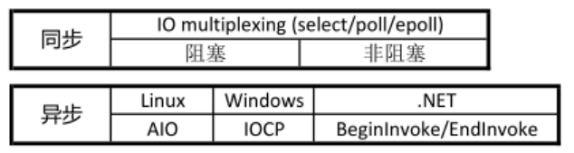
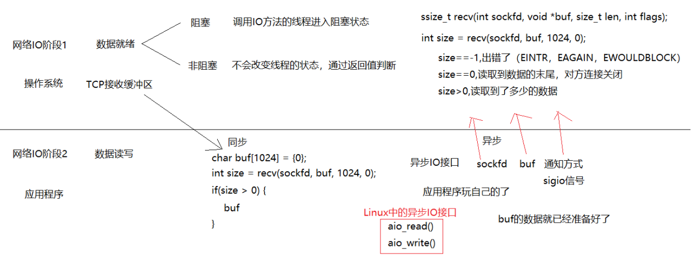
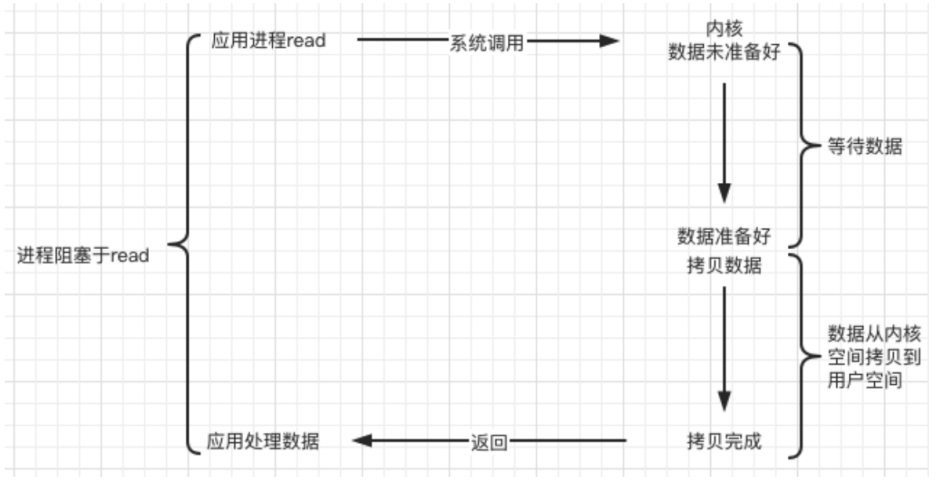
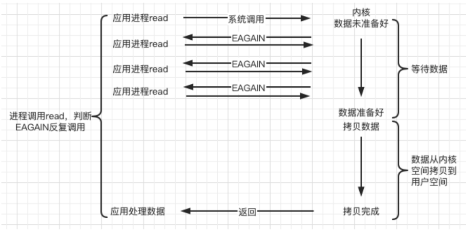
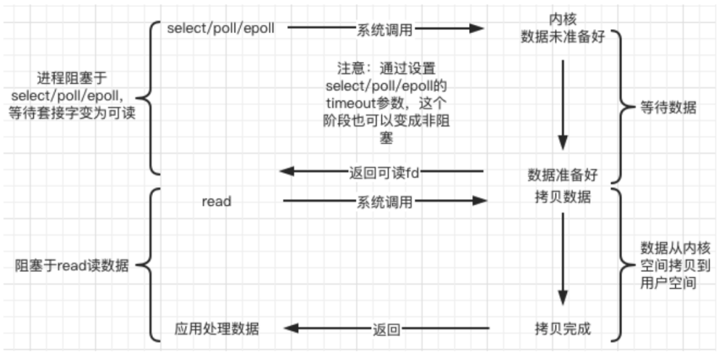
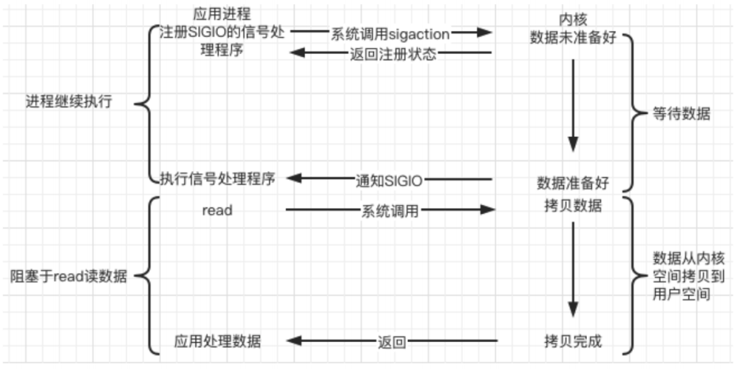
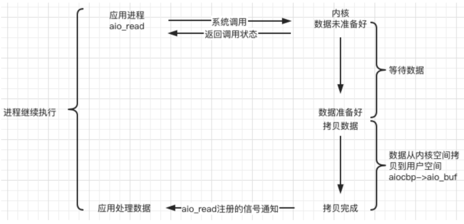

# 说明

本部分笔记及源码出自`slide/05项目实战`

# 阻塞/非阻塞 & 同步/异步

- 一个典型的网络IO接口调用，分为两个阶段，分别是`数据就绪` 和 `数据读写`

- `数据就绪阶段`分为`阻塞`和`非阻塞`

  - 阻塞：阻塞当前线程，直到满足条件
  - 非阻塞：直接返回，等满足条件时再通知

- `数据读写阶段`分为`同步`和`异步`

  - 同步：当A向B请求调用一个网络IO接口时(或者调用某个业务逻辑API接口时)，**数据的读写都是由请求方A自己来完成的(不管是阻塞还是非阻塞)**
  - 异步：A向B请求调用一个网络IO接口时(或者调用某个业务逻辑API接口时)，**向B传入请求的事件以及事件发生时通知的方式，A就可以处理其它逻辑了**，当B监听到事件处理完成后，会用事先约定好的通知方式，通知A处理结果

- 小结

  > 陈硕：在处理 IO 的时候，阻塞和非阻塞都是同步 IO，只有使用了特殊的 API 才是异步 IO

  

- 图示说明

  

  - `sockfd`对应操作系统中的TCP接收缓冲区
  - `recv`默认阻塞，直到读到数据才往下执行，如果设置为非阻塞，那么就应该通过返回值判断
    - `size == -1`：说明读取出错了，但有几种例外需要判断，如产生了`EINTR`(信号捕捉回收子进程资源时产生`SIGCHLD`导致这个信号)，`EAGAIN/EWOULDBLOCK`信号
    - `size == 0`：读到文件末尾，即对方连接已关闭
    - `size > 0`：读到了大小为`size`的数据

- 参考

  - [linux中对errno是EINTR的处理](https://blog.csdn.net/hnlyyk/article/details/51444617)
  - [Linux中的EAGAIN含义](https://www.cnblogs.com/pigerhan/archive/2013/02/27/2935403.html)

# Unix/Linux上的I/O模型

## 阻塞(BIO, blocking)

- 调用者调用了某个函数，**等待这个函数返回，期间什么也不做**，不停的去检查这个函数有没有返回，必须等这个函数返回才能进行下一步动作



## 非阻塞(NIO, non-blocking)

- 非阻塞等待，**每隔一段时间就去检测IO事件是否就绪，没有就绪就可以做其他事**
- 非阻塞 I/O 执行系统调用总是立即返回，不管事件是否已经发生
- 若事件没有发生，则返回-1，此时可以根据 `errno` 区分这两种情况，对于`accept`，`recv` 和 `send`，事件未发生时，`errno` 通常被设置成 `EAGAIN`



## IO 复用(IO multiplexing)

- Linux 用 `select/poll/epoll` 函数实现 IO 复用模型，这些函数也会使进程阻塞，但是**和阻塞IO所不同的是这些函数可以同时阻塞多个IO操作**
- 可以同时对多个读操作、写操作的IO函数进行检测。直到有数据可读或可写时，才真正调用IO操作函数



## 信号驱动(signal-driven)

- Linux 用套接口进行信号驱动 IO，安装一个信号处理函数，**进程继续运行并不阻塞，当IO事件就绪，进程收到SIGIO 信号，然后处理 IO 事件**
- 下图中，内核在第一个阶段是异步，在第二个阶段是同步
- 与非阻塞IO的区别在于它提供了消息通知机制，不需要用户进程不断的轮询检查，减少了系统API的调用次数，提高了效率



## 异步(asynchronous)

- Linux中，可以调用 `aio_read` 函数告诉内核**描述字缓冲区指针和缓冲区的大小、文件偏移及通知的方式**，然后立即返回，当内核将数据拷贝到缓冲区后，再通知应用程序

```c
/* Asynchronous I/O control block. */ 
struct aiocb { 
    int aio_fildes; /* File desriptor. */ 
    int aio_lio_opcode; /* Operation to be performed. */ 
    int aio_reqprio; /* Request priority offset. */ 
    volatile void *aio_buf; /* Location of buffer. */ 
    size_t aio_nbytes; /* Length of transfer. */ 
    struct sigevent aio_sigevent; /* Signal number and value. */ 
    
    /* Internal members. */ 
    struct aiocb *__next_prio; 
    int __abs_prio; 
    int __policy; 
    int __error_code; 
    __ssize_t __return_value; 
    
#ifndef __USE_FILE_OFFSET64 
    __off_t aio_offset; /* File offset. */ 
    char __pad[sizeof (__off64_t) - sizeof (__off_t)]; 
#else 
    __off64_t aio_offset; /* File offset. */ 
#endif 
    char __glibc_reserved[32]; 
};
```

